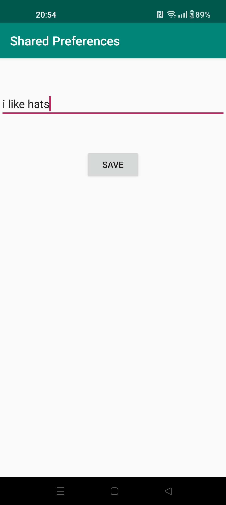

# Rapport

I denna uppgift sparas en string i shared preferences i en aktivitet och sedan visas den i en annan activitet.

Kod för att spara till shared preferences
```
    public void savePref(View v){
        //Hämta text
        EditText newPrefText;
        newPrefText=(EditText)findViewById(R.id.settingseditview);

        //spara till Shared Preferences
        myPreferenceEditor.putString("name", newPrefText.getText().toString());
        myPreferenceEditor.commit();


        // reset
        newPrefText.setText("");
        startActivity(new Intent(SecondActivity.this, MainActivity.class));
    }
```

Här hämtas en string från shared preferences  
```
    @Override
    protected void onResume() {

        super.onResume();
        //Hämta text
        myPreferenceRef = getSharedPreferences("shareBetweenActivity", Context.MODE_PRIVATE);
        //sätt in text i TextView
        TextView prefTextRef = new TextView(this);
        prefTextRef = (TextView) findViewById(R.id.prefText);
        prefTextRef.setText(myPreferenceRef.getString("name", "No preference found."));
    }
```

Bild som visar aktivitet med text


Bild som visar vad texten ska ändras till


Bild som visar att texten har ändrats


